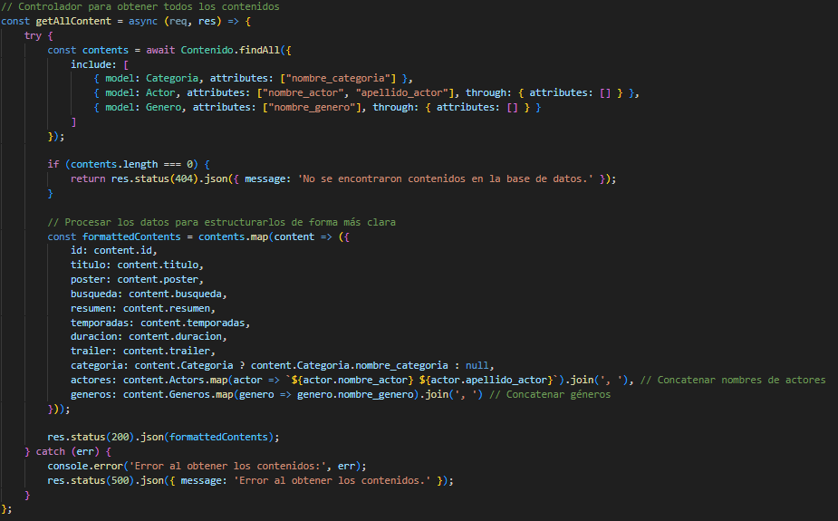
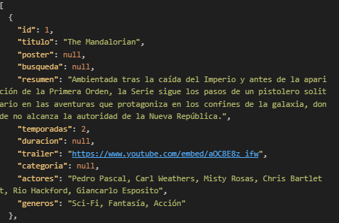
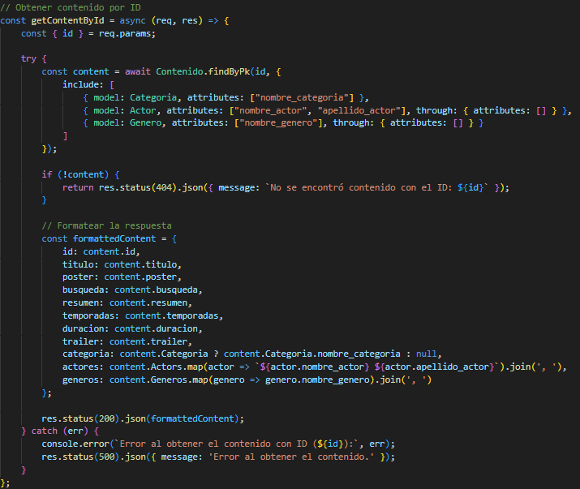
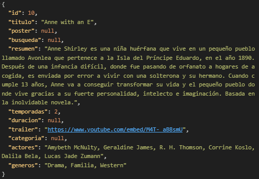
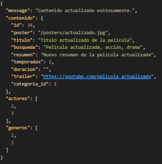

# Proyecto Integrador: Relacional Backend Diplomatura UNTREF

### Copia el proyecto
1. **Fork** el repositorio desde [aquí](https://github.com/ivopalomeque/Trabajo-Integrador-Relacional-Backend-Diplomatura-UNTREF/fork).
2. **Clona** tu fork en tu máquina local.
   
   ```bash
   git clone https://github.com/ivopalomeque/Trabajo-Integrador-Relacional-Backend-Diplomatura-UNTREF
   ```

## Instalación antes de empezar el proyecto:
- npm init -y
- npm install express -e
- npm install sequelize
- npm install --save mysql2

## Pasos a seguir para inicializar el proyecto

- Descargar MySQL Workbench e inicializar un servidor a nivel local (<a href="https://dev.mysql.com/doc/workbench/en/wb-getting-started-tutorial-create-connection.html"> Documentación Oficial </a>)
- Insertar la base de datos del proyecto en Workbench
  
  <a></a> 

- Insertar los datos dentro de la misma 
  
   <a></a> 

- Cambiar el nombre del archivo ".env copy" a ".env"

   <a></a> -----> <a></a>

- Cambiar los valores dentro del archivo .env según corresponda
  
   <a></a> 

- Luego de todos estos pasos, se puede ejecutar el proyecto con el comando "npm start" en la terminal.
  
   <a></a> 

## Endpoins

### Endpoint que devuelve todos los contenidos de la base de datos

<div>
	<p>
		<a></a>
	</p>
</div>

#### GET en api

<div>
	<p>
		<a></a>
	</p>
</div>

#### Resultado en REST Client

<div>
	<p>
		<a></a>
	</p>
</div>

### Endpoint para buscar por id

<div>
	<p>
		<a></a>
	</p>
</div>

#### GET en api

<div>
	<p>
		<a></a>
	</p>
</div>

#### Resultado en REST Client

<div>
	<p>
		<a></a>
	</p>
</div>

### Endpoint para filtrar contenido

<div>
	<p>
		<a></a>
		<a></a>
</div>

#### GET en api

<div>
	<p>
		<a></a>
	</p>
</div>

#### Resultado en REST Client

<div>
	<p>
		<a></a>
	</p>
</div>

### Endpoint para actualizar contenido

<div>
	<p>
		<a></a>
	</p>
</div>

#### PUT en api

<div>
	<p>
		<a></a>
	</p>
</div>

#### Resultado en REST Client

<div>
	<p>
		<a></a>
	</p>
</div>

### Endpoint para eliminar contenido

<div>
	<p>
		<a></a>
	</p>
</div>

#### DELETE en api

<div>
	<p>
		<a></a>
	</p>
</div>

#### Resultado en REST Client

<div>
	<p>
		<a></a>
	</p>
</div>

## Modelo de Base de Datos

- contenido: Tabla principal con la información de películas y series.
- categoria: Define si el contenido es una película o una serie.
- genero: Almacena los géneros como Ciencia Ficción, Fantasía, etc.
- actor: Información sobre los actores principales de cada contenido.
- tabla intermedia contenido_actor: Relaciona el contenido con los actores.
- tabla intermedia contenido_genero: Relaciona el contenido con los géneros.

## Funcionalidades del CRUD

1. **Obtener todos los contenidos**
   - Endpoint que devuelve todos los contenidos de la base de datos.
   - Control de errores para manejar la indisponibilidad de la base de datos.

2. **Obtener un contenido por ID**
   - Endpoint para obtener un contenido específico.
   - Control de errores para manejar casos en que el contenido no exista.

3. **Filtrar contenidos**
   - Endpoint para filtrar por título, género o categoría.
   - Control de errores para manejar coincidencias no encontradas o problemas de conexión.

4. **Agregar un nuevo contenido**
   - Endpoint para agregar una nueva pelicula o serie a la base de datos.
   - Validación de campos obligatorios.

5. **Actualizar un contenido:**
   - Endpoint para actualizar información como temporadas o reparto.
   - Control de errores para manejar actualizaciones fallidas.
     
6. **Eliminar un contenido**
   - Endpoint para eliminar un contenido de la base de datos.
   - Control de errores para manejar problemas durante el borrado.

7. **Control de errores**
   - Manejo de errores en la estructura de las solicitudes y respuestas.
   - Respuesta adecuada con mensajes y códigos de error específicos.
   - Control de acceso a rutas no existentes con respuestas apropiadas.

## Estructura del Repositorio

```plaintext
/DB_Trailerflix
  - inserts_trailerflix.sql
  - trailerflix.sql
/json
  - trailerflix.json
/controllers
  - contenidoController.js
/src/conexion
  - database.js
/src/controllers
  - contenidoController.js
/src/models/
  - actor.js
  - categoria.js
  - contenido_actor.js
  - contenido_genero.js
  - contenido.js
  - genero.js
/src/routes/
  - contenidoRoutes.js
/.env copy
/api.http
/app.js
/README.md
```

## Profesores:
   - [FabioDrizZt](https://github.com/FabioDrizZt)
   - [JuanNebbia](https://github.com/JuanNebbia)
   - [NKrein](https://github.com/NKrein)
   - [mathiasbarbosa](https://github.com/mathiasbarbosa)

## Alumno
   - [ivopalomeque](https://github.com/ivopalomeque)